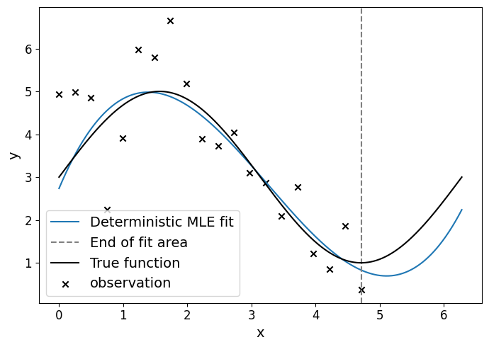
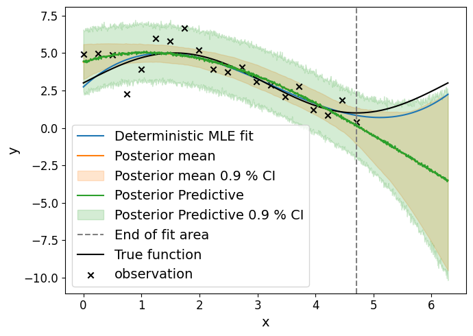

# Equayes

The **Equayes** library converts a deterministic SymPy expression into a probabilistic model and performs Bayesian (MCMC) inference on the expression's numeric constants. This enables uncertainty quantification over parameters, credible intervals for predictions, principled noise estimation, and robustness against overfitting — while keeping your original symbolic model structure.

The project exposes the scikit-learn style estimator **Equayes** that automates replacing numeric constants with learnable latent variables, compiles the symbolic model into a Pyro probabilistic model, and runs MCMC inference.

## Highlights
- Converts an equation given as SymPy expressions to a probabilsitic (Pyro) model. See [create_pyro_model()](equayes/core/pyro_backend/sympy_to_pyro.py) in sympy_to_pyro.py
- Simple scikit-learn style API: Equayes(expr, input_symbols, output_dim) with fit(), predict(), get_posterior(), and inference_diagnostics().
- Supports any parameterized function $f_\theta:(x_1, x_2, ..., x_N) \rightarrow (y_1, y_2, ..., y_M)$ with parameters $\theta \in \mathcal{R}^K$ and scalar inputs $x_i, y_j \in \mathcal{R} \text{, }\forall i, j$. 

## Show Case
To illustrate the practical gain, we consider noisy observations generated from a sinusoidal ground-truth process $y \sim \mathcal{N}\left(2 * \text{sin}(x) + 3, 1\right)$, $x \in [0, \frac{3}{2}\pi]$ and fit a polynomial surrogate of degree 3. This setup is intentionally misspecified: the polynomial surrogate model cannot represent the true sinusoid exactly, which mirrors most real-world problems in which the available analytical model is useful but not exact.

<div id=fig_reconstruction>
   <table  align="center">
      <tr>
         <td align="center">
            
         </td>
         <td align="center">
            
         </td>
      </tr>
      <tr>
         <td colspan="2" align="center">
            <em>Figure 1: Comparison of deterministic and probabilistic polynomial fit (degree 3). Left: deterministic point estimate. Right: Equayes posterior predictive mean with 95% credible intervals. The widening credible intervals from x > 4 indicate increasing uncertainty due to limited data support.</em>
         </td>
      </tr>
   </table>
</div>

<a href="#fig_reconstruction">Figure 1</a> shows that the deterministic solution provides a single reconstruction and therefore hides epistemic uncertainty caused by limited support in parts of the input domain. In contrast, the Bayesian fit by Equayes yields a posterior predictive mean (variance caused by parameter uncertainty only), and full posterior predictive distribution  together with  95 % credible intervals. In the example the credible intervals widen substantially outside of the training region reflecting the uncertainty inherent to extrapolation.

This problem and implementation can be found in [showcase_equayes.ipynb](notebooks/showcase_equayes.ipynb)

## Install the Project
If you want to use this project or wish to contribute, the recommended setup is as follows:

- Clone this repository:

  ```bash
  git clone https://github.com/mclprobability/Equayes.git
  cd Equayes
  ```

- Install the package in **editable mode**:

  ```bash
  pip install -e .
  ```

This approach ensures that any changes you make to the code or documentation are immediately applied when you run your code. Once satisfied with your modifications, commit them locally and utilize your Git expertise.

> **Note:** Direct pushing to the `main` branch is disabled.  

## Contributing
We are very happy about each and every contribution! Please review our [Contribution Guidelines](CONTRIBUTING_GitHub.md) prior to your work.

## Minimal Example
Minimal example usage of the tool - a more comprehensive example is provided in [showcase_equayes.ipynb](notebooks/showcase_equayes.ipynb). 

```python
import sympy as sp
import torch

from equayes import Equayes

# 1) Define a simple SymPy model: y = a*x + b
x = sp.symbols("x")
expr = 2. * x + 5.

# 2) Create synthetic data (batch, features) and targets (batch, output_dim)
X = torch.randn((4,1))    # shape (4,1)
y = torch.randn((4,1))    # shape (4,1)

# 3) Init the estimator and run MCMC (small number of samples for demonstration)
equayes = Equayes(expr, input_symbols=[x], output_dim=1, mcmc_samples=200, mcmc_warmup_samples=200)

# 4) Fit and predict
equayes.fit(X, y)    # runs MCMC
preds = equayes.predict(X, n_predictive_samples=200)  # predictive samples 

# 5) Inspect posterior / diagnostics
idata = equayes.get_posterior()        # ArviZ InferenceData
diag = equayes.inference_diagnostics() # MCMC diagnostics
```

### Notes
- y must be 2D (batch, output_dim) and X (if present) must be 2D (batch, features).
- The compiled Pyro model uses Normal priors for parameters and a HalfNormal prior for observation noise; see [sympy_to_pyro.py](equayes/core/pyro_backend/sympy_to_pyro.py) for details.